# fapmap
Hidden personal gallery of erotica (C#, GUI)

Programs in this repository:
- fapmaper ("fapmaper" is the "installation" program... all it really does is copy the contents from the "data" folder to the given location, then it hides the destination folder):
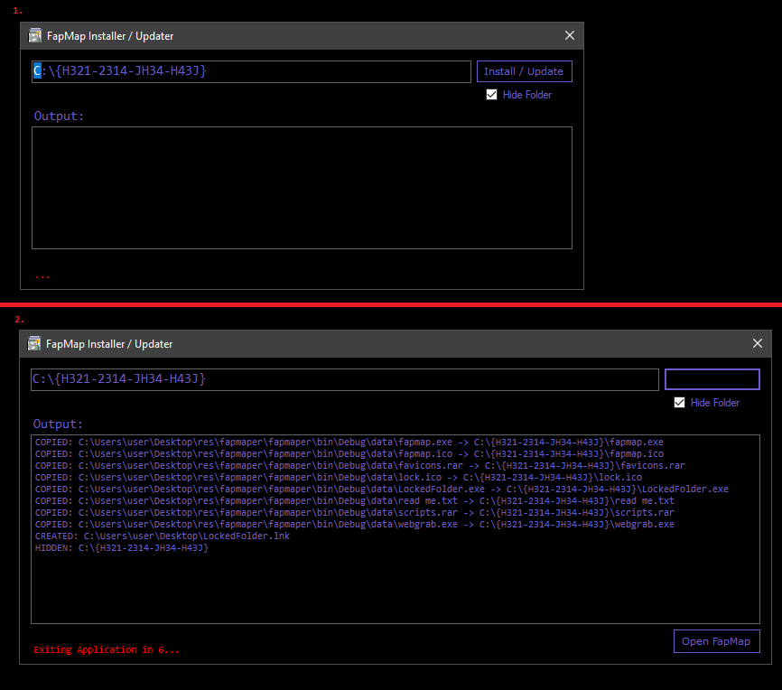

- Lock (LockedFolder) (password GUI) ("Lock" should be the entry point of your gallery. The program is supposed to be accessed through a shortcut on your desktop. When open the user should be prompted with a password GUI (the password is stored in the data/password.dll file)):
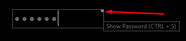

- fapmap ("fapmap" is the file browser, ... (see below for more info)):
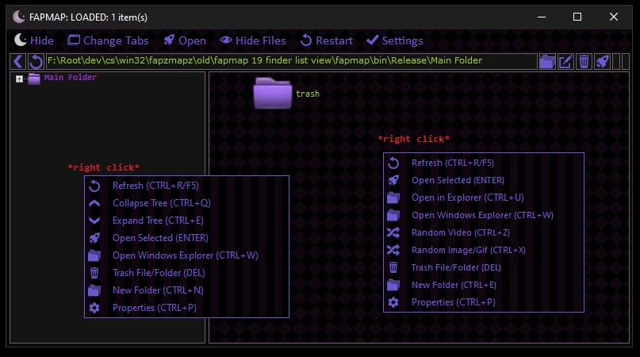
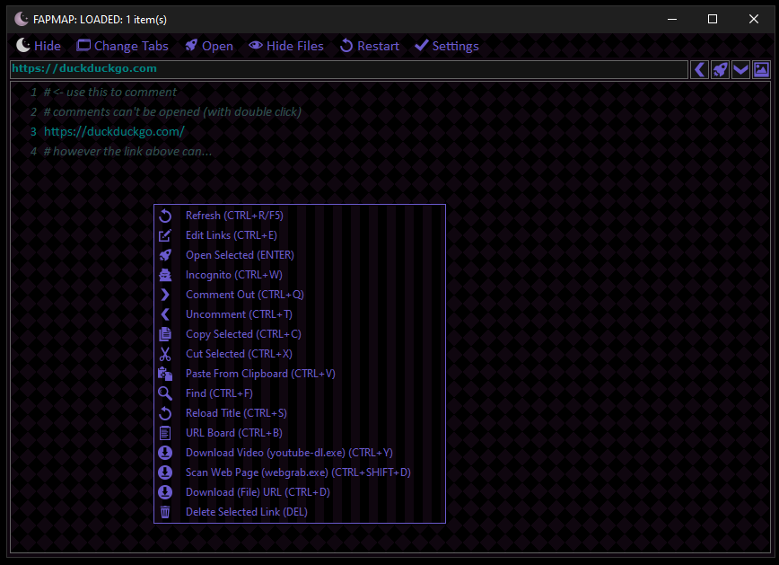

FAPMAP CONTAINS:
- custom video player UI (uses WMP binaries)
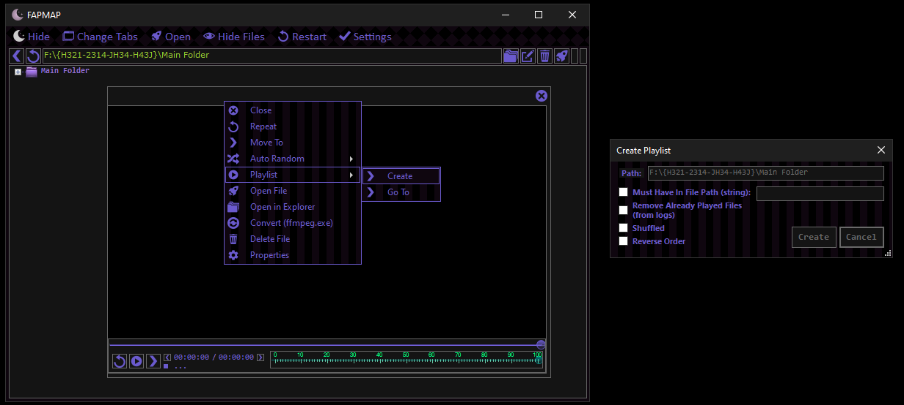
- custom image/gif viewer UI
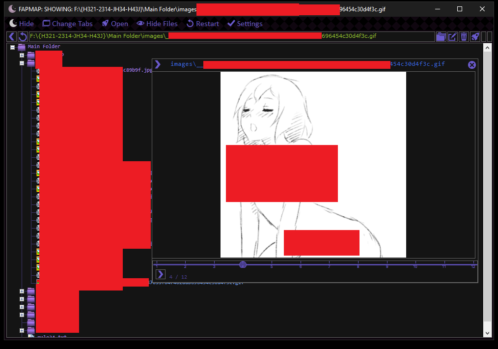
- a file downloader (equipped with a webpage scanner for files (webgrab) and an UI for youtube-dl)
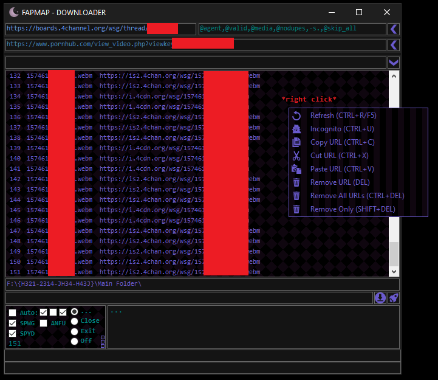
- a video converter (uses ffmpeg)
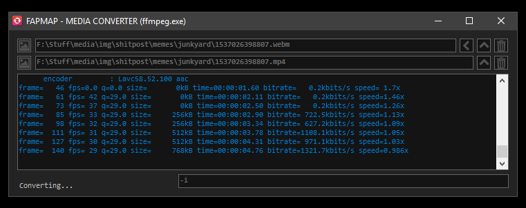
- a file/dir finder
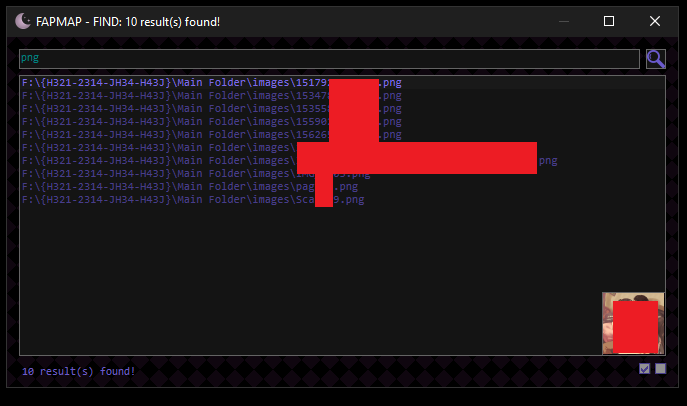
- an editable URL/website board with favicons
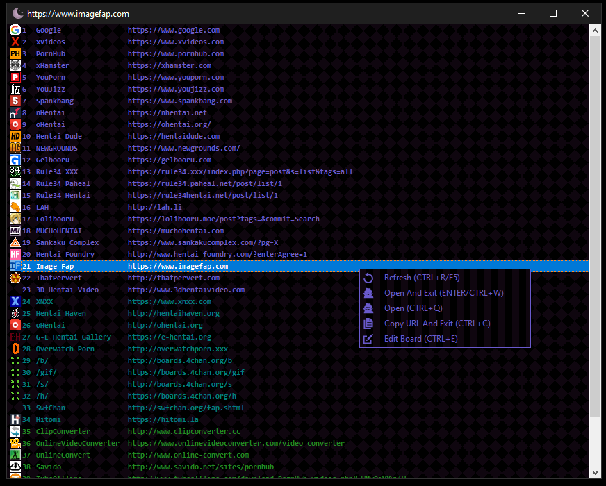
- settings (./data/fapmap.ini)
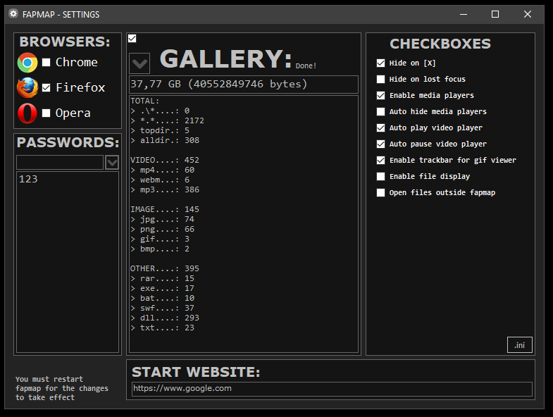

OTHER INFO:
- Some of the icons/images used in the GUI can be found on the web...
- HINT: hover over buttons to see what they do... (tooltip)
